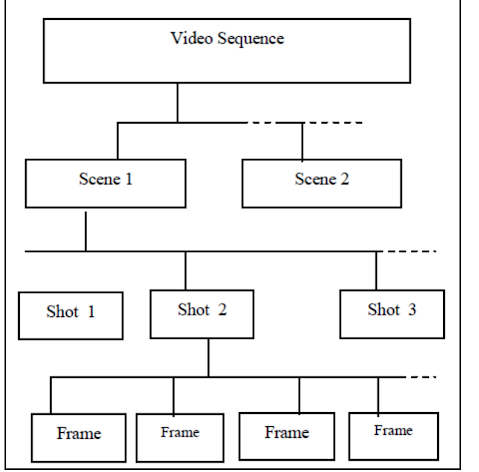
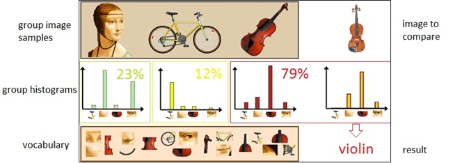
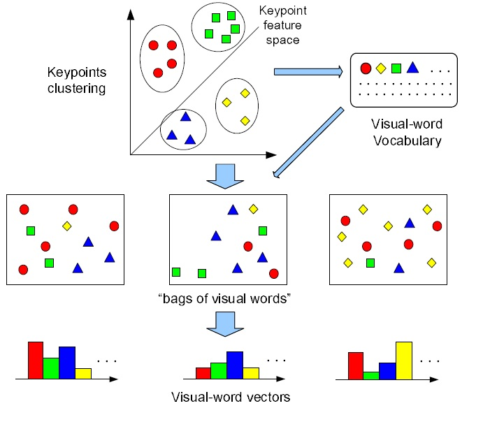
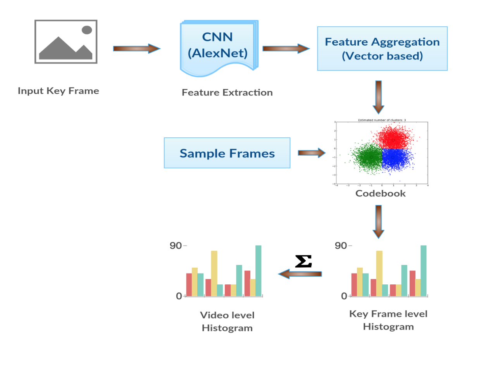
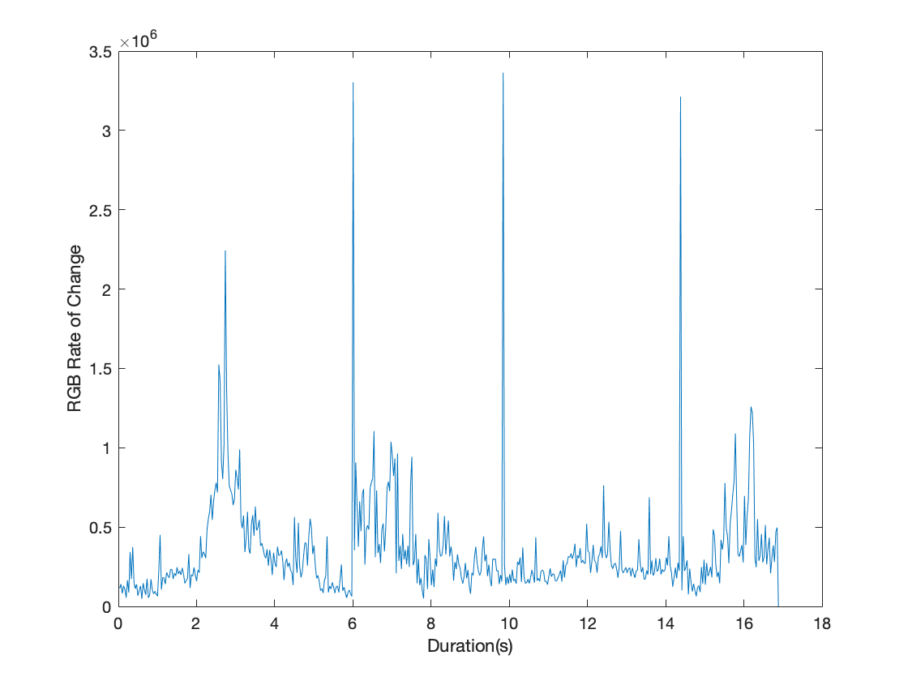
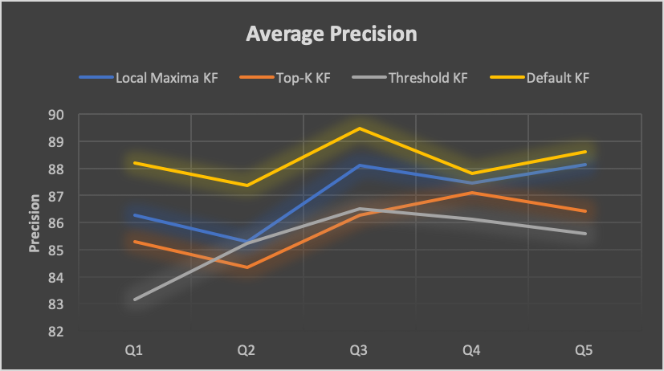
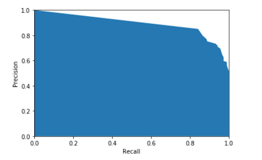
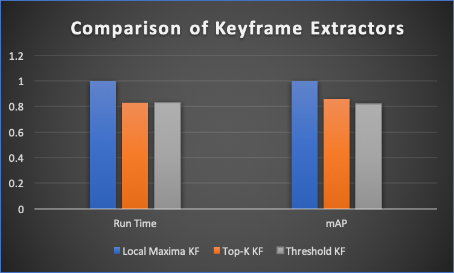

## Introduction

In this project we have performed near duplicate video retrieval/detection (NDVD) using a CNN based approach. With several state-of-the-art approaches available such as Multi-view hashing, Pattern-based approach, ACC, and CNN-based models we chose the CNN based model. Motivated by the use of CNN's over a wide variety of computer vision problems, we leverage the power of a pre-trained neural network to generate a global-level video histogram by means of vector aggregation over smaller components. We have modified the problem of NDVR into a model of querying a video database. In essence, the problem statement is - _Given a dataset of videos and a query from a new video, we aim to retrieve a ranked list of near-duplicate videos_. 

## Problem Domain

The problem of Near duplicate video retrieval is a sub-problem of the duplicate videos domain. In the latter, two videos are exact duplicates and hence, techniques that work at extracting and comparing pixel-by-pixel equality or signatures of keyframes work very well. The former class (chosen for this project) allows for format - scale, encoding, transformations or content modifications - watermarks, lightning, color changes. Hence, this model requires further featurization and deep net techniques for efficient detection of near duplicates.

## Significance of Near Duplicate Video Retrieval (Motivation)

The growth of video content has grown explosion exponentially over the last decade. With more than three-quarters of internet traffic being driven by video content and several large companies hosting video-sharing networks, it has become a core component of the internet world today. An interesting point of note is the high degree of near duplicates that have observed in this traffic.

Owing to this factor, companies build robust systems to detect and avoid storing duplicates (or certain video content) based on their policies. All of the above has spurred interest towards and NDVR, and, we have attempted to utilize this opportunity and built one such system.

## Exploration of Keyframe extractors
A video can be split into scenes, shot, and frames as shown in the following diagram - a common representation of keyframe extraction steps. 

In this project, we explore several keyframe extractor techniques as they serve as input to the CNN model. We also trade-off the performance and runtime of said techniques to provide a situational analysis of when to pick a particular model. Following is a summarization of some common techniques:

1. **Sequential Comparison between frames** - compare frame by frame and choose frames with high difference values.
2. **Global Comparison between frames** - Minimize a predefined objective function by using the global difference between frames
3. **Curve Simplification** - Represent frames as points in the feature space to formulate a trajectory curve. Key frames are the points that give the best representation to the shape of the curve.
4. **Clustering** - Each frame is a data point in the feature space. Cluster frames, then the frames that have smallest distances (closest) to cluster centers are selected.

We have picked _Sequential Comparison between frames_ method for our exploration and have implemented three subtechniques under this domain - local maxima, top k, and threshold parameter based methods.

## Dataset for experiment

Our model has been deployed on the widely used [_CC_WEB_VIDEO_](http://vireo.cs.cityu.edu.hk/webvideo/) dataset which is a common benchmarking dataset used in this domain. The original dataset provides about 13k videos and 400k keyframes. Given our compute and storage resources, we have downsampled the data using common subsampling techniques. The dataset also provides required metadata to parse each video with its corresponding keyframes. The data is annotated with labels like _E (Exactly duplicate), S (Similar video), V (Different  video). 

## State-of-the-art Methods

While several methods have been applied in this problem domain, following are four common method categories that have yielded efficient performance metrics previously. 

### Auto Color Correlograms (ACC): 
This method extracts one frame per second from the original video and ACC of each such frame is computed and aggregated based
on visual codebook. The near-duplicate video is identified using TF-IDF weighted cosine similarity over the visual word histograms of a query and a dataset video.

### Stochastic Multi-view Hashing (SMVH): 
It combines multiple keyframe features to learn a group of mapping functions that project video keyframes into the Hamming space. The combination of keyframe hash codes generates a video signature that constitutes the final video representation. A composite Kullback-Leibler (KL) divergence measure is used to compute similarity scores.

### Pattern-based approach (PPT): 
Pattern based indexing tree is build based on the encoding from keyframes. M-pattern based dynamic programming (mPDP) and time-shift m-pattern similarity (TPS) to determine video similarity.

### Convolutional Neural Networks Modes (CNN): 
Frame descriptors are extracted using some pre-trained network. A video-level histogram representation derives from either layer-wise or vector-wise aggregation of visual words. The similarity between two videos is computed as the tf-idf weighted cosine similarity over the video-level histograms.

## Approach

Our approach is inspired by the CNN based aggregation technique. At a high-level, it follows the bag-of-visual word (BOVW) model, where, for each video, a histogram is generated and then compared across query videos. First, we provide a mapping of this approach to the BOVW model, followed by an overview of our neural network architecture (Alexnet). We have then detailed our system components.

### Mapping to Bag-of-Visual-Words Model (BOVW)

In the BOVW world image features replaces actual words. These features are unique patterns in each image and can be detected via any extractor algorithm such as SIFT or KAZE. Given the complexity of the problem, which must adapt to changes in scale, encoding, transformations, or text overlays, we have used a pre-trained CNN (Alexnet) for feature extraction. 

The next step in this process is to generate clusters from the descriptors using any common clustering mechanism. The center of each cluster will be used as the visual dictionary vocabularies that can then be used for histogram matching for query images. 

### Model components

This diagram provides an overview of the required components for this model. Input keyframes can either be pulled from the initial dataset or could be generated using other keyframe extraction techniques implemented. This is followed by the feature extraction stage where a pretrained CNN - Alexnet is used to extract the features by making a forward pass of each of the keyframes with max pooling at intermediate steps.  

[Alexnet](https://papers.nips.cc/paper/4824-imagenet-classification-with-deep-convolutional-neural-networks.pdf) contains _5 convolutional layers and 3 fully connected layers_. Relu is applied after very convolutional and fully connected layer. Dropout is applied before the first and the second fully connected year. This is followed by codebook generation which is performed using k-means clustering. Each keyframe is then identified using the nearest cluster leading to a keyframe level histogram. _The video level histogram is then generated by performing a vector aggregation of all the individual keyframe histograms_. 

The aforementioned components provides us with a trained model like codebook which can be used for video querying. To perform querying, an inverted index structure is created to perform cosine similarity matching using tf-idf between histograms. 

### Keyframe technique implementation

As mentioned before, we have implemented the Sequential Comparison between frames paradigm. The algorithm for the three techniques starts with computing a difference value for each frame (by comparing with previous frame). Subsequently, we choose a keyframe, either by picking a _local maxima based function_ (or) choosing _frames with sum of absolute difference over a threshold_ (or) picking _top K frames by ordering difference values_. A common representation of these techniques will lead to a intermediate representation as follows. Atop this representation we run different methods to pick out keyframes. 

## Results

The aforementioned model with default keyframes as well as our model run atop modified keyframe extractors were both deployed on the CC_WEB_VIDEO dataset. The dataset was subsampled owing to compute and storage constraints. The subsampling of data allowed us to run five different queries against both the models. The main metric for evaluation is average precision across queries and mAP across modified keyframe extractors. Following is the average precision graph observed over the three different modified extractors and compared against the default set of keyframes that have been provided. 

The above graph provides us with three key observations - First, the average precision observed here is only for five different queries due to subsampled data and hence, the mAP values are not directly comparable with current state-of-the-art results. Second, we observe that for certain queries, the mAP value is slightly lower as compared to other queries. We term these queries as “hard” queries owing to gradual transitions in the seed videos. This leads to the generated keyframes not being fully representative of the video and hence, leading to lossful featurization. Following is the P-R curve for one such hard query.

Third, the biggest takeaway is the impact of modified keyframe extractors atop the CNN model. Although, we have changed both the keyframe set size and extraction technique based on our own implemented models, we see that the impact on mean precision is negligible for most queries when compared to the default precision value. Hence, this can be viewed as an approximation of the modified keyframe paradigm with comparable results to the default keyframes provided.

The aforementioned factor can also be thought of as a possible trade-off in terms of keyframe computation runtime vs performance. The above graph provides us with a cross-sectional comparison between the modified keyframe extractors. We observed that the local maxima method provides us with the best performance (mAP) over different queries that we executed. On the other hand, top K and threshold based methods provides faster runtimes with comparable mAP metric. Hence, this trade-off can be utilized in real-world situations when either off faster runtime or better performance (background process rather than real-time) is required. This concludes our results and metrics discussion.

## Conclusion and Future Work

In this project, we implemented a model motivated by vector-based aggregation in a CNN to perform NDVR and observed P-R curves for five different query sets. We also implemented several keyframe extractor techniques to serve as input to the aforementioned CNN model. Modified Keyframe extractors provide interesting computation opportunities and accuracy vs runtime trade-offs.

In the future, we are considering three directions as follows: 

1. Challenging datasets with different domains of videos (including distractors) and consider domain-specific featurization. 
2. Can we perform NDVR on low-quality video datasets using the same model and keyframe extractors?
3. Are ensemble mechanisms possible during inference?

## Challenges encountered

This project was a great learning curve for our team and helped us gain a deeper understanding of Convolutional Neural Networks in the domain of Computer Vision along with some key learnings about keyframe extraction techniques. Nevertheless, we faced three major challenges during this process:

1. The size of the CC_WEB_VIDEO dataset was far beyond our compute and storage constraints and hence, we had to make do with downsampled data. Due to this, we were only able to deploy our model on a portion of the query set available. With the leverage of more storage and compute power, we could have fleshed out more interesting observations of using the said model for NDVR.

2. Interpreting and understanding the use of Alexnet in the context of NDVR by previous state-of-the-art approaches was a challenge in itself. The complexity of aggregating from intermediate steps led to a challenging but great experience of breaking down a neural net.  

3. A very interesting extension of the project (never attempted before) is applying the said model on low-quality video datasets. We attempted premilinary training efforts on the same but lack of a large near duplicate video dataset (like CC_WEB_VIDEO for low quality domain) was a hiccup as the model began overfitting. As mentioned before, this would be one of the immediate future directions for this project.

## Appendix

### Project Files and Code

All files and code for this project can be found in the github link present at start of this webpage. It can be executed by deplyoing the CNN-main file inside CNN module folder. The Keyframe_Extractors module provides the different techniques we implemented for extracting keyframes and can be deployed seperately on different video datasets.

### Team members
Anuja Golechha, Shivanee Nagarajan, Varun Ramesh.
